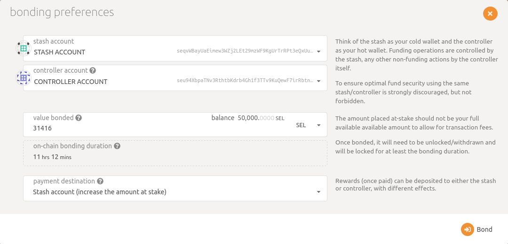
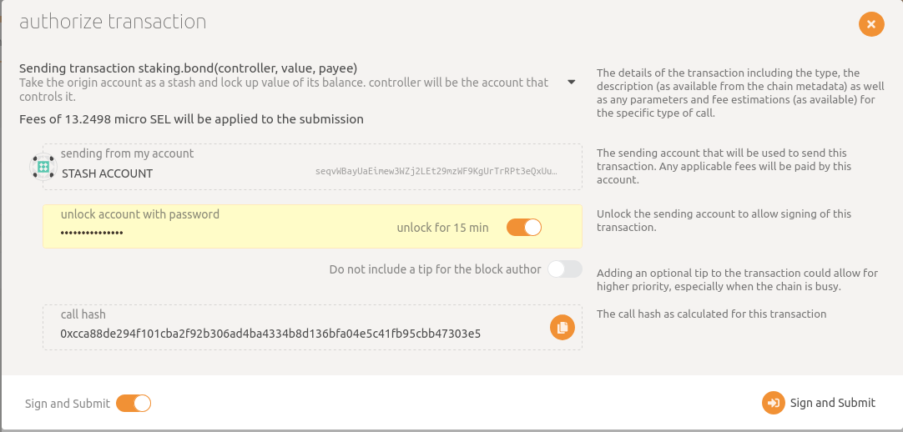

# Run a Validator on Selendra-Chain
This guide will instruct you how to set up a validator node on the **Selendra** network.

## How many SEL do I need ?​
 To became **Selendra** validator you need to stake at least **31416 SEL**. This stake amount can come from yourself or from nominators. This means that as a minimum, you will need enough **SEL** to set up Stash and Controller accounts with the existential deposit, plus a little extra for transaction fees. The rest can come from nominators.
 
 ***Warning***: Any **SEL** that you stake for your validator is liable to be slashed, meaning that an insecure or improper setup may result in loss of **SEL** tokens! If you are not confident in your ability to run a validator node, it is recommended to nominate your SEL to a trusted validator node instead.

### Install & Configure Network Time Protocol (NTP) Client
NTP is a networking protocol designed to synchronize the clocks of computers over a network. NTP allows you to synchronize the clocks of all the systems within the network. Currently it is required that validators' local clocks stay reasonably in sync, so you should be running NTP or a similar service.

 ```sh
# Check if NTP is installed and running, you should see System clock synchronized: yes 
timedatectl
# If you do not see it, you can install it by executing
sudo apt-get install ntp
```

***WARNING***: Skipping this can result in the validator node missing block authorship opportunities. If the clock is out of sync (even by a small amount), the blocks the validator produces may not get accepted by the network. This will result in ImOnline heartbeats making it on chain, but zero allocated blocks making it on chain.
 
 ## Run Selendra-Chain from source
 To Install and build Selendra-Chain see [here](https://github.com/selendra/selendra-chain/blob/main/docs/from_source.md).
 How run validator node see [here](https://github.com/selendra/selendra-chain/blob/main/docs/run_validate_node.md).

 ## Run Selendra-Chain from docker

To run Selendra-Chain with docker see [here](https://github.com/selendra/selendra-chain/blob/main/docs/from_docker.md).

## Bond SEL

It is highly recommended that you make your controller and stash accounts be two separate accounts. For this, you will create two accounts and make sure each of them have at least enough funds to pay the fees for making transactions. Keep most of your funds in the stash account since it is meant to be the custodian of your staking funds.
Make sure not to bond all your **SEL** balance since you will be unable to pay transaction fees from your bonded balance.
It is now time to set up our validator. We will do the following:

Bond the **SEL** of the Stash account. These **SEL** will be put at stake for the security of the network and can be slashed.
Select the Controller. This is the account that will decide when to start or stop validating.

First, go to the Staking section. Click on "Account Actions", and then the "+ Stash" button.



- Stash account - Select your Stash account. In this example, we will bond 31,416 SEL, where the minimum bonding amount is 31,416. Make sure that your Stash account contains at least this much. You can, of course, stake more than this.
- Controller account - Select the Controller account created earlier. This account will also need a small amount of SEL in order to start and stop validating.
- Value bonded - How much SEL from the Stash account you want to bond/stake. Note that you do not need to bond all of the SEL in that account. Also note that you can always bond more SEL later. However, withdrawing any bonded amount requires the duration of the unbonding period.
- Payment destination - The account where the rewards from validating are sent. Payouts can go to any custom address. If you'd like to redirect payments to an account that is neither the controller nor the stash account, set one up. Note that it is extremely unsafe to set an exchange address as the recipient of the staking rewards.

Once everything is filled in properly, click Bond and sign the transaction with your Stash account.



Your bonded account will available under Stashes. You should now see a new card with all your accounts. The bonded amount on the right corresponds to the funds bonded by the Stash account.


## Set Session Keys

The session keys are consensus critical, so if you are not sure if your node has the current session keys that you made the setKeys transaction then you can use one of the two available RPC methods to query your node: [hasKey](https://polkadot.js.org/docs/substrate/rpc/#haskeypublickey-bytes-keytype-text-bool) to check for a specific key or [hasSessionKeys](https://polkadot.js.org/docs/substrate/rpc/#hassessionkeyssessionkeys-bytes-bool) to check the full session key public key string.

## Generating the Session Keys
#### Option 1
Once ensuring that you have connected to your node, the easiest way to set session keys for your node is by calling the author_rotateKeys RPC request to create new keys in your validator's keystore. Navigate to Toolbox tab and select **RPC Calls** then select the **author > rotateKeys()** option and remember to save the output that you get back for a later step.

#### Option 2

```sh
curl -H "Content-Type: application/json" -d '{"id":1, "jsonrpc":"2.0", "method": "author_rotateKeys", "params":[]}' http://localhost:9933
```


## Submitting the setKeys Transaction

You need to tell the chain your Session keys by signing and submitting an extrinsic. This is what associates your validator with your Controller account.

Go to **Staking > Account Actions**, and click "Session Key" on the bonding account you generated earlier. Enter the output from author_rotateKeys in the field and click "Set Session Key".


Submit this extrinsic and you are now ready to start validating.

## Validate

Go to **Staking > Account Actions**, and click "validate".

- The "reward commission percentage" is the commission percentage that you can declare against your validator's rewards. This is the rate that your validator will be commissioned with.

- You can also determine if you would like to receive nominations with the "allows new nominations" option.


Congratulations! If you have followed all of these steps, and been selected to be a part of the validator set.

## How to Stop Validating

If you wish to remain a validator or nominator (e.g. you're only stopping for planned downtime or server maintenance), submitting the chill extrinsic in the staking pallet should suffice. It is only if you wish to unbond funds or reap an account that you should continue with the following.

- Chill your validator
- Purge validator session keys
- Unbond your tokens

### Chill Validator​
To chill your validator or nominator, call the **staking.chill()** extrinsic. You can also claim your rewards at this time.

### Purge validator session keys
Purging the validator's session keys removes the key reference to your stash. This can be done through the **session.purgeKeys()** extrinsic with the controller account.

***NOTE***: If you skip this step, you will not be able to reap your stash account, and you will need to rebond, purge the session keys, unbond, and wait the unbonding period again before being able to transfer your tokens

### Unbond your tokens​
Unbonding your tokens can be done through the **Network > Staking > Account actions** by clicking the corresponding stash account dropdown and selecting **"Unbond funds"**. This can also be done through the **staking.unbond()** extrinsic with the controller account.
